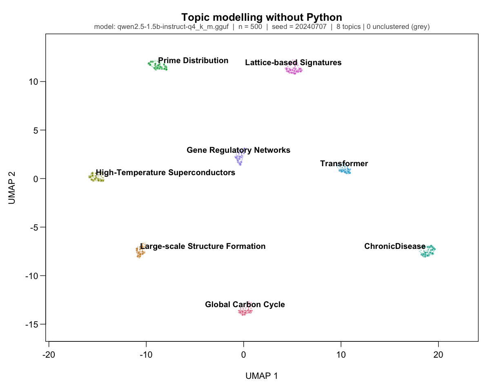

# R-ebirth · relm

**Local language models and model research in ordinary R.**

R-ebirth is delivered as **relm**, an R package that runs open-weight models on
your machine. Generate text, produce constrained JSON, embed documents and
inspect a model's internal activity. Results are ordinary character vectors,
`data.frame`s and matrices, ready for R's statistical and plotting tools.

The native engine is a pinned, patched llama.cpp embedded through Rust. No
Python, model server or API key is required. relm runs on stock R >= 4.5.



*The [topic-modelling demo](rebirth/vignettes/topics-without-python.qmd) combines
relm embeddings with optional UMAP and HDBSCAN packages, then asks the model to
name each cluster.*

## relm 0.3.0

**Version 0.3.0** adds structured output, statistical probes and operational
application examples. See the [release notes](rebirth/NEWS.md#relm-030).
Binary availability follows r-universe builds; check the installed version
before using the new features.

The new release brings together:

- **Structured output:** `llm_generate(schema = ...)` returns complete JSON
  matching a supported bounded schema, or a classed R error.
- **Native Spark support:** Spark-X2.5-4B generation through llama.cpp b10828,
  including its official non-thinking opener for constrained chat. Spark
  activation tracing remains unsupported.
- **Statistical probes:** `llm_probe()` fits binary ridge models to activations
  with grouped cross-validation, development-only selection and optional held-out
  evaluation. A probe measures how readily a label can be predicted from a model's
  internal values; predictive success alone does not establish causal use.
- **Operational examples:** an [offline, resumable batch application](examples/funding-extraction/README.md)
  and a [loopback service template](examples/funding-service/README.md) with a
  persistent model worker, durable tickets and bounded resources. Their optional
  application dependencies stay outside the relm core.

Generation, tokenization, embeddings, text-and-image input, activation tracing,
steering and ablation remain available. Activations are the numerical values
inside a model; steering adds a chosen direction to those values, while ablation
sets selected units to a fixed value to investigate their effect.

## Install and start

[r-universe](https://vadale.r-universe.dev/relm) distributes macOS and Linux builds
and tracks the repository's `main` branch. Check the installed version before
using the 0.3.0 additions:

```r
install.packages(
  "relm",
  repos = c("https://vadale.r-universe.dev", getOption("repos"))
)
packageVersion("relm")
```

Start with the [package quickstart](rebirth/README.md#quickstart) or the
[installation guide](docs/getting-started.md). The package README includes
generation, structured output and a small activation trace. The guide covers
source builds, image input and troubleshooting.

## Development: background generation and token streaming

WP9 adds background generation; WP10 adds streaming data on the same worker.
These are development features after the 0.3.0 tag. Check that your installed
`llm_generate()` has `on_token` before trying the streaming example:

```r
pending <- llm_generate(m, "Explain bootstrap resampling.", seed = 17,
  async = TRUE, on_token = function(batch) {
    cat(paste0(batch$text[batch$event == "text"], collapse = ""))
  })
observed <- promises::then(pending, function(value) print(value),
  onRejected = function(error) message(conditionMessage(error)))
```

Load `m` using the quickstart first. Optional `later` and `promises` packages
are required. Callbacks receive bounded plain-data-frame batches containing
token IDs, committed text and prompt-end events. They run on R's thread, so
keep them short. `llm_cancel(m)` requests cooperative cancellation; a caller-owned
binary file connection can receive the event CSV instead. See the
[streaming guide](rebirth/vignettes/token-streaming.qmd),
[live token-statistics demo](tests/demos/demo-streaming.R) and
[implementation status](docs/wp10-implementation.md).

## What has been validated

Numerical paths are checked against independent references, with the scope of
each comparison recorded in the [validation ledger](docs/validation-status.md).
The batch and service examples passed their declared Mac/Linux operational
acceptance; service stress includes 1,000 requests on one persistent worker.
The [0.3.0 release report](docs/release-0.3.0.md) records packaging, installed-package
checks and the remaining CRAN-readiness findings.
The [service report](docs/service-implementation.md) preserves exact source
provenance and separates the stress measurements from later lifecycle checks.

These results do not establish extraction accuracy. The frozen D1 pilot produced
10/10 schema-valid outputs, but only 2/10 task-valid and 0/10 fully grounded
records; all four quality promotion gates failed. See the
[evaluation report](docs/d1-extraction-evaluation.md). Likewise, steering and
ablation are research instruments for auditing model behavior, not guarantees
of safety or bias removal.

Windows/CUDA, tracing inside the vision encoder, and several larger-model
hardware checks remain open. The [public execution plan](docs/structured-production-plan.md)
records the completed increment and later work. WP9 and WP10 are integrated in
development; I1 external-assistant integration is the current companion work.

## Statistical analysis with an external assistant

The optional [R Statistical Analysis skill](integrations/skills/r-statistical-analysis/SKILL.md)
guides a compatible assistant through statistical work using the R ecosystem:
from group comparisons to repeated-measures, survival and other specialist
analyses. It produces reproducible code, interpretable estimates, uncertainty
and diagnostics. Ordinary statistics does not require relm or a model download.

This repository companion is separate from the relm 0.3.0 package. It requires
an R runtime and an assistant with execution tools; broad ecosystem support is
a routing capability, not a claim that every method has been tested. See
[local installation and usage](integrations/README.md), the
[integration plan](docs/i1-assistant-plan.md) and
[observed results and limits](docs/i1-implementation.md).
Local R computation does not make a hosted assistant offline: selected tool
results can enter model context. Public marketplace acceptance is separate.

## Repository and development

| Path | Contents |
|---|---|
| `rebirth/` | R package, installed as `relm` |
| `rebirth/src/rust/` | Native Cargo workspace: `rebirth-llm` and `rebirth-ffi` |
| `rebirth/src/llama.cpp/` | Pinned engine, patches and vendoring provenance |
| `tests/llm-golden/` | Independent numerical references |
| `tests/demos/` | Runnable research demos |
| `examples/` | Funding batch and service applications |
| `integrations/skills/` | Portable assistant skills outside the relm core |
| `docs/` | Design, acceptance evidence and installation guide |

For builds and contributions, read the [architecture](ARCHITECTURE.md) and
[development workflow](docs/development-workflow.md). The public specifications
are [SOLO-PHASE-PLAN.md](SOLO-PHASE-PLAN.md), the
[execution plan](docs/structured-production-plan.md), [API-GRAMMAR.md](API-GRAMMAR.md)
and [DECISIONS.md](DECISIONS.md).

## License

Original code is dual-licensed **MIT OR Apache-2.0**; see [LICENSE.md](LICENSE.md).
Vendored llama.cpp is MIT; see [NOTICE](NOTICE). Modified redistributions must
rename under the [trademark policy](TRADEMARK.md).
