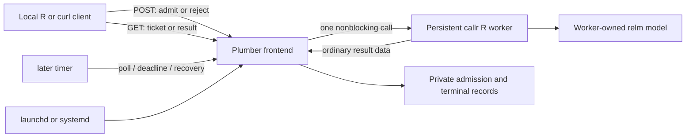

# WP12a — Minimal funding-extraction service contract

Date: 2026-09-28. **PROPOSED — D-034 requires founder approval before WP12b.**
This is a reviewed implementation specification, not a running service. No
service package has been installed and no runtime/load gate has passed.

**Acceptance (verbatim, ROADMAP):** reviewable contract, exact proposed
dependencies/versions and commands/thresholds/ownership for WP12b. This is
planning and a bounded feasibility check, not a delivered service or a claim
that load/stress tests already passed.

The [machine-readable limits and gates](../tests/service-contract/contract.json)
and [dependency pins](../tests/service-contract/dependencies.csv) accompany this
contract. Its offline checker verifies consistency, not HTTP or model behavior.

## 1. Recommendation and practical outcome

Provide an application template under `examples/funding-service/` using
**Plumber 1.3.3 + callr 3.8.0 + later 1.4.8**. A small R frontend receives HTTP
requests and is the sole persistent writer. A separate persistent R worker owns
one model and processes one extraction at a time. A ticket response lets the
caller disconnect and retrieve a committed result later. Extra work is rejected
immediately: one active request, zero queued requests, no scheduler to maintain.

Start with **one trusted user on loopback**, on macOS arm64/Metal or Linux/CPU.
This turns the already tested D2 workflow into a reusable local process with
explicit setup/start/status/stop/recovery commands. It does not provide a shared
network service, a deployment platform, or the generic `llm_serve()` API. A
small-team network deployment needs a later existing access-control/reverse-proxy
recipe and its own acceptance; changing the bind address is insufficient.

| Option considered | Decision |
|---|---|
| Plumber + callr + later | Recommend: explicit worker identity, persistent R state, nonblocking dispatch, process termination and parent-exit supervision |
| Plumber + mirai + promises | Defer: useful async integration, but interrupt-based cancellation cannot guarantee stopping native inference; whole-daemon teardown adds lifecycle work here |
| Synchronous Plumber in the model process | Reject for this contract: inference blocks readiness, overload handling and deadlines on the same R event loop |

This is an application dependency expansion: the proposed closure has **23
non-base CRAN packages**, including already approved jsonlite, plus existing
relm/nanoarrow. No package enters relm Imports/Suggests, and no core export changes.
The direct application calls use plumber 1.3.3, callr 3.8.0, later 1.4.8,
httpuv 1.6.17, ps 1.9.3 and jsonlite 2.0.0. The complete mandatory closure,
including processx, promises, otel, magrittr and rlang, is explicit in the CSV.
No `otelsdk`, telemetry exporter, mirai, renv or web authentication dependency is
selected. Source installation can require native/system libraries; setup
snapshots an already installed trusted environment, as D2 does.

## 2. Verified integration points and ownership

D2's `app_run()` verifies and opens an entire batch, owns its writer lock and
closes its engine at batch completion. Calling that function per HTTP request
would repeatedly hash the model and defeat persistent loading. Instead reuse
`app_prompt()`, `app_parse_json()`, `app_validate_output()`, canonical hashing and
atomic-write helpers from `examples/funding-extraction/app.R`. The worker creates
`app_engine()` once after initialization and closes it on ordinary shutdown.
A service-specific identity/envelope wraps the same domain result, raw output
and failure accounting. Existing D2 run directories and records are never reused
or migrated implicitly; existing batch behavior stays unchanged.

Use the documented Plumber `call()`/`onHeaders()` methods behind a small
`httpuv::startServer()` adapter, so header checks run before body parsing.
Disable automatic parsers (`none`), browser documentation and debug responses;
apply D2's literal JSON parser explicitly. The adapter delegates routing and
HTTP transport to existing packages; it is not a new HTTP implementation.
The frontend services its event loop and a 100 ms `later` timer. It never calls
blocking `r_session$run()` or waits for generation in an endpoint.

Create `callr::r_session$new(wait = FALSE)` with an explicit prepared `libpath`,
disabled user/system profiles and `extra = list(supervise = TRUE)`; assert
`$is_supervised()` before initializing the model. `$call()` dispatches only
trusted application functions. Poll with `$poll_process(0)` and consume `$read()`
events, distinguishing initialization/messages/completion/exit. Readiness means
initialization completed, the loaded identities match, and no job is active.
Only plain request/configuration/result values cross the process boundary;
never send a model, external pointer, engine closure or fork-inherited R session.

Use piped stdout/stderr with bounded nonblocking reads, including startup: at
most 64 KiB per timer tick and 1 MiB combined per initialization/request. Discard
their contents after byte accounting; health/event logs use only allowlisted
fields. Catch errors and muffle ordinary warnings/messages in the trusted worker
wrapper before callr can forward arbitrary condition objects. A diagnostic flood
retires the worker; do not accumulate unbounded strings or read all output at
completion. The real-process G3 fixture verifies control responsiveness here.

At an operation deadline, retire its epoch, invoke `$kill()`, and confirm death
before creating a replacement. Do not infer hard cancellation from an R
interrupt. The documented processx `grace` argument is currently unused; it is
not a timing promise. Startup/poll/kill behavior must be tested with the pins.

## 3. HTTP and request contract

Default bind: `127.0.0.1:8765`; IPv6/all-interface binding is outside v1.
Clients use HTTP/1.1, one JSON object per POST, and poll no faster than once per
second. No uploads, arbitrary paths/R code, custom prompts/schemas/models,
activation transfers, WebSockets, streaming or per-request sampling options.

| Route | Behavior |
|---|---|
| `GET /health/live` | 200 while the frontend can serve requests; minimal version/state, no source text |
| `GET /health/ready` | 200 only when admission is possible; otherwise 503 with state (`starting`, `busy`, `restarting`, `faulted`, `stopping`) |
| `POST /v1/extractions` | 202 plus ID/status URL only after durable admission and dispatch; no wait for inference |
| `GET /v1/extractions/<id>` | 202 while accepted/running; 200 with an immutable terminal envelope; 404 for unknown IDs |

POST body: exactly `id`, `target`, `text`, `seed`, matching the D2 development
input shape. ID is 1–64 ASCII characters, starts alphanumeric and continues
with alphanumerics/underscore/hyphen; seed is a lexical integer in
`0..2147483647`. Target and text are nonempty valid UTF-8 strings. Reject
unknown/duplicate keys, invalid Unicode, NUL and floating/exponent seed syntax;
D2's parser rules remain in force. JSON property order is immaterial after
canonicalization. The HTTP API has no user-configurable output path.

A repeated ID with the same canonical input and service identity returns the
existing 202/200 receipt/result, without re-execution. Different input for an
existing ID returns 409, including changed seed. A distinct new request while
busy returns 429 plus `Retry-After: 1`; while unavailable, 503 plus that header.
Cached requests remain readable while the worker restarts. Changing the service
identity requires a new store; results from another configuration are not reused.

Admission failures: malformed JSON/framing 400, missing POST Content-Length 411,
oversized content 413, wrong content type/encoding 415, valid JSON with invalid
fields 422, forbidden Host/Origin 403. Accept only `application/json` (optional
UTF-8 charset), no Content-Encoding, no Transfer-Encoding, exactly one valid
bounded Content-Length. Reject ambiguous/duplicate framing headers. GET has no
body. Reject browser Origin headers and non-loopback Host values; do not enable
CORS. This is a trusted local-client boundary, not authentication against other
users or compromised processes on the same machine. Raw-socket tests must prove
the pinned HTTP parser rejects ambiguity before application dispatch.
The compute deadline starts at admission, after a complete bounded body arrives.
It is not an upload timeout or a denial-of-service guarantee against local peers.
G1 must verify that incomplete uploads closed by the client release resources
without admission; slow-client connection management remains httpuv's behavior.

Terminal states are `success`, `invalid`, `error`, `interrupted`; GET uses 200
for the record itself even when extraction failed. Clients must inspect state.
`success` means domain/type/quote checks passed, not semantic correctness.
Preserve raw output for invalid extraction within the serialized limits below,
and record classed generation errors
(including context overflow) without inventing a result. Use an allowlisted
external error message and omit paths, stack traces and source contents from
health/event logs. Request/result files intentionally contain private data.

Measure the complete UTF-8 JSON terminal envelope before publication: escaping
can expand raw bytes sixfold. If raw output exceeds 64 KiB or the envelope exceeds
128 KiB, publish `error` with reason `output_limit`, never a truncated `success`.
The bounded fallback references the immutable admission instead of copying input
or parsed output. Include `raw_truncated: true`, original raw byte count and its
SHA-256, plus at most 4 KiB of valid UTF-8 raw prefix (end at a code-point boundary;
omit the prefix for invalid encoding). Its allowlisted metadata, including JSON
framing/keys, must fit 4 KiB; measure the final serialization again. Full raw
preservation is explicitly unavailable in this overflow case. Failure to publish
even this bounded record follows the storage-failure path, never false success.

## 4. Persistence, crashes and recovery

The frontend is the only writer to a private store (directory mode 0700,
files 0600). Freeze a service manifest with contract/application/D2-helper hashes,
R/platform, every prepared package fingerprint, native-library/model digests,
backend, prompt/schema and sampling settings. Verify once at startup and worker
initialization, not by rehashing a multi-GB model on every request. The prepared
library and model must remain immutable while running. Startup rejects changes.

Privacy includes callr's serialized functions/arguments/results and diagnostic
temporary files. Create an owned per-worker-epoch IPC directory under a private
runtime root (0700; umask 0077 and files 0600). Override inherited `CALLR_TMPDIR`
in the frontend before creating/calling the worker, and set child `CALLR_TMPDIR`,
`TMPDIR`, `TMP` and `TEMP` to that epoch directory before R starts. No IPC file
may land in an inherited/shared temporary location. Record its path/owner/epoch
with the service lock. Monitor aggregate IPC bytes every 100 ms: 64 MiB is a
stop threshold with possible sampling overshoot, separate from the result-store
quota. Consumed per-call files may be cleaned normally; recursive epoch cleanup
requires confirmed worker death. After frontend SIGKILL, reclaim only proven
owned/dead epochs; unknown ownership blocks recovery rather than deleting data.
Verify permissions, redirected temp paths, output floods, byte accounting and
post-crash cleanup with the pinned callr version in G3/G4.

Each ID has an immutable admission record containing input, its digest, service
identity, timestamp and worker epoch. Publish it before dispatch. The one-slot
reservation and publication occur without yielding the frontend event loop.
Only a complete, identity-checked terminal record is published by same-directory
rename and then exposed to callers. The worker never publishes files. Completion
with an old epoch, wrong ID or wrong input digest cannot commit or release a
new worker's slot. A terminal record is never overwritten.

Admission failure before publication means no accepted job; failure after
publication becomes a terminal error/interruption, with no automatic retry.
Frontend crash before dispatch, during inference, or before result publication
leaves an unresolved admission: after verified recovery, mark it interrupted.
A crash after result rename preserves the result byte-for-byte, even if the
client never saw it. Reconnection with the same ID reads that result.
Retrying an interrupted/failed extraction requires an explicit new ID.

The store lock records host, frontend/worker PID and process creation time,
plus a nonce/epoch; PID alone cannot authorize recovery. Parent-exit supervision
must terminate its worker. Restart waits for that exact old process to die
before loading a new model. If ownership/death cannot be established, remain
unavailable and require operator inspection; never kill an unrelated reused PID,
recover an arbitrary D2 lock, or infer safety from lock age. Corrupt/foreign
records fail startup rather than being deleted or silently recomputed.

A deadline or worker exit marks its accepted job interrupted, checks confirmed
death, and initializes a new worker. Unexpected serialization/protocol failures
also retire that worker. A recoverable classed inference error records `error`;
subsequent request isolation must pass before that recovery path is accepted.
Three failed automatic restart attempts in 300 seconds latch `faulted`; an
explicit operator restart is required. No restart loop silently continues work.

Ordinary stop disables admission, drains for at most 10 seconds, then kills an
unfinished worker and records interruption; the whole stop takes at most 15
seconds and leaves no worker. No HTTP administrative stop/restart route is
exposed. A launchd LaunchAgent on Mac and systemd user unit on Linux supervise
the frontend; their restart/backoff/stop settings must preserve this ownership.

Guarantees cover process interruption on tested local filesystems, not power
loss or hostile filesystem replacement. A failed write closes admission; do not
report terminal publication when it failed. After storage repair, the persisted
admission permits explicit recovery. Store capacity is bounded, with no automatic
result deletion. Export/copy a stopped store and start a new one when full.

## 5. Frozen operating envelope (proposed acceptance targets)

The JSON artifact is authoritative for numbers. They are targets for WP12b,
not throughput or memory guarantees already demonstrated by upstream packages.

| Limit | Value and measurement |
|---|---|
| Active inference / accepted queue | 1 / 0; OS connections and HTTP callbacks are not an application job queue |
| Request / text / target / ID | 16 KiB body / 8 KiB UTF-8 text / 256 bytes / 64 ASCII bytes |
| Model context / generated output | 4,096 / 768 tokens, fixed by operator; byte length does not guarantee a prompt fits the chat template |
| Raw output / terminal record | 64 KiB / 128 KiB; oversized completion is an explicit failure |
| Overflow prefix / fallback metadata | 4 KiB / 4 KiB; final JSON size checked, no copied input/result |
| Worker diagnostic output | 1 MiB per initialization/request; drain at most 64 KiB per control tick |
| Per-epoch IPC temporary storage | 64 MiB monitored threshold; private, cleaned after verified death |
| Deadline / death confirmation | 120 s from admission / 5 s from kill decision; expired work cannot later succeed |
| Initialization / recovery | 120 s / 125 s from fault detection to a fresh ready worker; failure closes admission |
| Timer / client polling | 100 ms / at least 1 s |
| Health responsiveness | p95 ≤250 ms and every response ≤1,000 ms during inference and recovery |
| Admission or busy rejection | p95 ≤500 ms and every response ≤1,000 ms in the 20-client burst |
| Mac Spark process RSS | ≤8 GiB for frontend + worker + owned supervisor process |
| Mac/Linux Qwen process RSS | ≤3 GiB for the same process set |
| Store | ≤10,000 accepted IDs and ≤2 GiB; ≥1 MiB write headroom before admission |
| Long session | 1,000 unique native Qwen requests, same worker, no hidden recycling |
| Memory growth | Last-100 median post-request RSS minus requests 1–100 median ≤256 MiB; fitted RSS slope after request 100 ≤256 KiB/request |

Sample process RSS and liveness every 100 ms using process identity-aware `ps`
handles. Record maxima and baseline/tail distributions; shared pages can be
counted twice. An exceeded budget retires the worker and fails acceptance.
This is a monitored stop condition with possible sampling/termination overshoot,
not an OS-enforced allocation ceiling or a measurement of all Metal device
memory. Record backend resource logs and host memory pressure separately; do
not infer a safe larger-model tier from Qwen acceptance. No second model worker
may overlap a dying one. Treat frontend persistence/timer latency as measured,
not inherently nonblocking because inference is elsewhere.

D2's measured Mac Spark peak was 4.84 GiB and first result 24.30 s; Linux Qwen
was 863.67 MiB and 24.29 s. These motivate headroom, not extrapolated service
benchmarks. HTTP normal load is 30 sequential development requests; overloaded
clients are deliberately rejected, never used to claim high throughput.

## 6. Setup and reproducibility

WP12b will add `setup.R`, `start.R`, `status.R`, `stop.R`, operator configuration
and supervisor templates in `examples/funding-service/`. These names are planned
files; commands are specified in the acceptance README and do not run today.
Setup explicitly prepares a separate service library/receipt from trusted
installed pins. Snapshot all 23 dependency packages plus relm/nanoarrow; record
resolved versions, recursive file fingerprints, model/native digests, R and OS.
Source/binary selection and system-library prerequisites are explicit. A partial
or mismatched snapshot cannot publish a ready environment.

Start, inference, status, stop and recovery install/download nothing. Tests deny
non-loopback network traffic; no telemetry exporter or SDK is installed or
configured. Pass a sanitized child environment, no user R profiles or inherited
telemetry credentials/endpoints. Existing external R libraries cannot satisfy
missing snapshot packages silently. Foreground mode remains the debugging path;
the user-level supervisor recipes are accepted separately on each OS.

The default configuration retains D2's fixed funding prompt/schema and sampling:
chat enabled, temperature 0, top-p 0.95, caller-provided seed. The model/backend
is explicit and immutable for the store. Setup may reuse an existing verified
GGUF in place; no second 4.38 GB Spark copy is required.

## 7. WP12b acceptance and stop conditions

[The executable plan](../tests/service-contract/README.md) assigns each gate a
command, fixture, numeric threshold and owner. Runtime runners are WP12b work.
The only runnable WP12a command is the offline contract checker.

- G1–G4: real HTTP/process behavior with a deterministic injected engine; raw
  framing, 20-client overload, same-ID races, deadlines, worker/frontend kills,
  late events, both rename boundaries, stale identity and corrupt data. Run on
  both Mac and Linux with the actual proposed HTTP/process packages.
- G5–G6: seeded A/B/A and fresh-worker comparison through native relm, including
  invalid output and context failure, recovery, setup/offline commands and
  resource reporting. Use the committed D2 **development** cases. Mac Spark
  smoke plus Mac/Linux Qwen; never tune on D1's consumed held-out pilot.
- G7: 1,000 real endpoint-to-native-result Qwen calls on **each** Mac Metal and
  Linux CPU. This is not 1,000 mocked requests or 1,000 health checks. Compare
  failure rates, RSS and PID/epoch to prove no concealed restarts; failed/invalid
  model outputs stay in accounting. Hardware-dependent runs may take hours;
  run once per final candidate, not for each documentation edit.
- G8: actual launchd/systemd installation, readiness, ordinary stop, frontend
  SIGKILL, restart backoff and zero orphan workers on a disposable test instance.
  Linux unit syntax validation alone is not execution; a CI container without
  a user service manager cannot certify this gate.

No gate is waived because a service starts or returns one result. If raw-header
limits, hard process death or native request isolation cannot be met using this
stack, stop at the failed gate and propose a specific correction. Do not add a
proxy/queue/dependency, raise thresholds or reduce stress cycles silently.

## 8. Primary evidence and decision

Reviewed on 2026-09-28:

- [Plumber public router methods](https://www.rplumber.io/reference/Plumber.html),
  [parser selection](https://www.rplumber.io/reference/pr_set_parsers.html) and
  [v1.3.3 source](https://raw.githubusercontent.com/rstudio/plumber/v1.3.3/R/plumber.R):
  routing, early size checks and parser control. Its website may show a development
  version; the selected runtime pin is 1.3.3.
- [httpuv server contract](https://rstudio.github.io/httpuv/reference/startServer.html):
  early header rejection and event-loop behavior.
- [callr session API](https://callr.r-lib.org/reference/r_session.html) and
  [options](https://callr.r-lib.org/reference/r_session_options.html): persistent
  worker, nonblocking submission and process options.
- [callr 3.8.0 CRAN source](https://cran.r-project.org/src/contrib/callr_3.8.0.tar.gz)
  (`R/r-session.R`, `R/utils.R`): temporary IPC files, `CALLR_TMPDIR`, output pipes
  and cleanup behavior inspected without installing the package.
- [processx lifecycle](https://processx.r-lib.org/reference/process.html): killing,
  supervision and process-state checks; [ps](https://ps.r-lib.org/): process
  identity and resource inspection.
- [mirai cancellation](https://mirai.r-lib.org/reference/stop_mirai.html): native
  computation may not respond promptly to interrupts.
- [Apple launchd guidance](https://developer.apple.com/library/archive/documentation/MacOSX/Conceptual/BPSystemStartup/Chapters/CreatingLaunchdJobs.html)
  and [systemd](https://systemd.io/): existing outer supervision. OS recipes still
  need actual target-host validation.
- [Official CRAN metadata](https://cran.r-project.org/src/contrib/PACKAGES.rds):
  complete proposed dependency versions; the downloaded metadata and CSV hashes
  are recorded in `tests/service-contract/dependency-provenance.json`. This is a
  version/metadata pin, not verification of installed package bytes.

**Founder decision:** approve D-034's application-only stack, full dependency
closure and local single-worker operating envelope. Approval permits WP12b
implementation and acceptance; it does not certify a working service, authorize
public hosting, or approve a new relm API.
