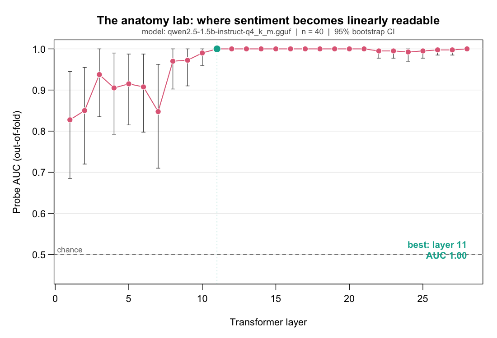
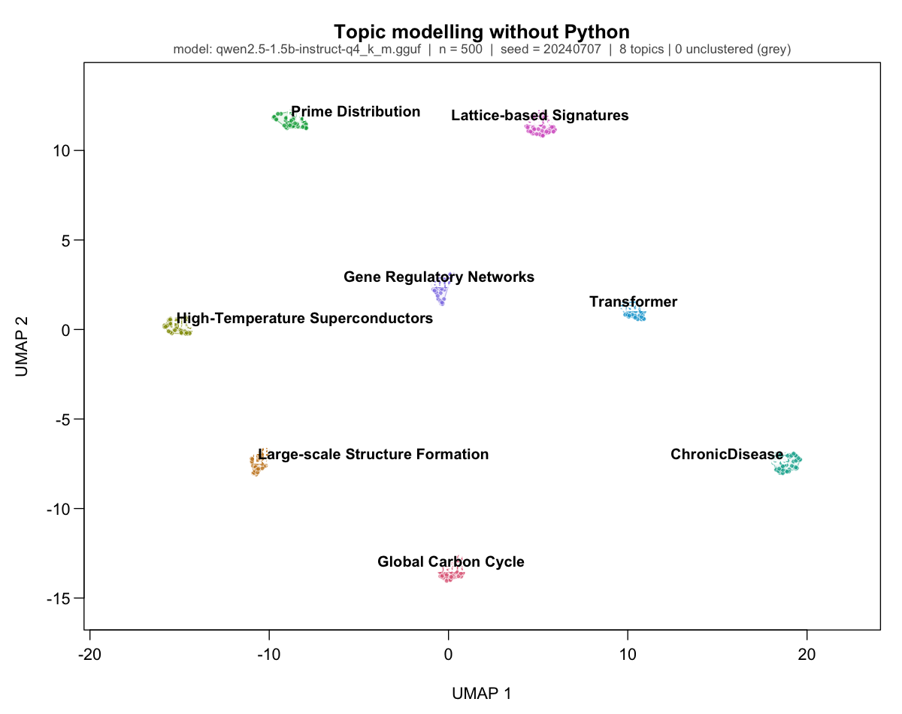

# relm

<!-- badges: start -->
[](https://github.com/Vadale/R-ebirth/actions/workflows/R-CMD-check.yaml)
[](https://vadale.r-universe.dev/relm)
[](https://lifecycle.r-lib.org/articles/stages.html#experimental)
[](https://github.com/Vadale/R-ebirth/blob/main/LICENSE.md)
<!-- badges: end -->

**Local large language models as base-R objects.**

`relm` runs open-weight LLMs on your own machine — no API keys, no Python — and
hands you the results as plain `data.frame`s and `matrix`es in ordinary base-R
idiom. It embeds a vendored, patched
[`llama.cpp`](https://github.com/ggml-org/llama.cpp) in a Rust native core, so the
heavy compute runs natively while your R session gets tidy objects it already
knows how to plot, model, and join.

What sets it apart from a plain inference binding is that it opens the model up.
Alongside generation and embeddings, `relm` exposes the model's **internals** as
first-class, tidy data — you can trace activations layer by layer, steer the
residual stream along a direction you found, and ablate individual units to see
what they were doing. This is mechanistic interpretability ("AI neuroscience")
from R, where your statistics and plotting live.

## Installation

Prebuilt binaries (macOS, Linux) are published on
[r-universe](https://vadale.r-universe.dev/relm) — **no Rust or C++ toolchain
required**:

```r
install.packages(
  "relm",
  repos = c("https://vadale.r-universe.dev", getOption("repos"))
)
```

**From source (GitHub).** With a Rust toolchain ([`rustup`](https://rustup.rs)),
CMake (>= 3.28), and a C compiler, you can install straight from the repo — this
works today, before any release is tagged:

```r
remotes::install_github("Vadale/R-ebirth", subdir = "rebirth")
# (pak::pak("Vadale/R-ebirth/rebirth") also works)
```

`relm` needs R (>= 4.5) and depends only on
[`nanoarrow`](https://arrow.apache.org/nanoarrow/) (for reading spilled traces);
the demo helpers use `glmnet`, `uwot`, and `dbscan` (optional `Suggests`). See
**[docs/getting-started.md](https://github.com/Vadale/R-ebirth/blob/main/docs/getting-started.md)**
for a first run, the demos, and troubleshooting.

## Quickstart

Download a small, checksum-verified model and talk to it. The pinned aliases are
Apache-2.0 licensed and fetched over HTTPS into a per-user cache, verified by
SHA256 (a mismatch is deleted, never used):

```r
library(relm)

path <- llm_download("qwen2.5-0.5b-instruct-q8_0")  # ~675 MB, verified
m <- llm(path)
m                                            # a one-line summary of the loaded model

# A raw completion (chat = FALSE) continues the prompt; the return is the
# continuation only, never the prompt echoed back:
llm_generate(m, "The capital of France is", chat = FALSE, max_tokens = 8, temperature = 0)
#> [1] " Paris."

# The default (chat = TRUE) applies the model's own chat template instead:
llm_generate(m, "Name three primary colors.", chat = TRUE, max_tokens = 24)
```

Everything returns base-R objects. Tokenize, read the next-token distribution, or
embed a character vector into a matrix:

```r
llm_tokens(m, "café")                       # named integer vector, 1-based ids
llm_logits(m, "The opposite of hot is", top = 5)   # data.frame: prompt_id, rank, token_id, token, logit, prob
emb <- llm_embed(m, c("cats", "kittens", "quarterly revenue"))  # 3-row matrix
tcrossprod(emb)                              # cosine similarities (rows are unit vectors)
```

## Look inside the model

The interpretability toolkit is the reason `relm` exists. Capture activations
as a tidy trace, find a direction, then intervene — all in base R:

```r
# 1. TRACE: capture the residual stream at every layer over the prompt's last token.
tr <- llm_trace(m, "The movie was absolutely wonderful.", positions = "last")
tr                                            # a relm_trace data.frame
as.matrix(tr, layer = 12, component = "residual")   # one slice as a numeric matrix

# 2. STEER: add a direction to the residual stream at a layer (returns a NEW handle;
#    the original m is untouched, so removing the effect is just using m again).
#    `joy_vec` is a direction you extracted from a trace -- see the anatomy-lab demo.
m_happy <- llm_steer(m, layer = 12, direction = joy_vec, coef = 6)
llm_generate(m_happy, "I walked into the office and", max_tokens = 20)

# 3. ABLATE: force chosen units to a value and watch what breaks.
m_lesion <- llm_ablate(m, layer = 12, neurons = c(41, 220, 512), value = 0)
```

Interventions **compose**, are **order-independent**, and are **exactly
reversible** (each derived handle is a fresh context over the same read-only
weights). If a model's architecture can't support an intervention faithfully,
`relm` refuses with a classed error rather than silently doing nothing.



*The anatomy-lab demo (below), real output: one cross-validated probe per layer
locates where sentiment becomes linearly readable in Qwen2.5-1.5B — here by layer
11 (AUC 1.00), with 95% bootstrap CIs. Produced by `run_demo_A()`.*

## Two worked demos

Both ship as runnable vignettes and reproduce end-to-end on the Apache-2.0 default
model — no gated downloads, no Python.

- **The anatomy lab** — `vignette("anatomy-lab", "relm")`. Trace a sentiment
  contrast set, fit one cross-validated probe per layer, and plot *where sentiment
  becomes linearly readable* against depth; then steer along that direction and
  confirm the effect on held-out prompts.

- **Topic modelling without Python** — `vignette("topics-without-python",
  "relm")`. Embed a corpus of abstracts with `llm_embed()`, lay it out with
  `uwot::umap()`, cluster with `dbscan::hdbscan()`, name each cluster with
  `llm_generate()`, and draw one labelled map — a BERTopic-class pipeline, fully
  local. A small sample corpus ships with the package, so it runs out of the box:

  ```r
  install.packages(c("uwot", "dbscan"))       # one-time (Suggests)
  model <- llm_download("qwen2.5-1.5b-instruct-q4_k_m")   # demo default, Apache-2.0
  # Follow the vignette, or source tests/demos/demo-B-topics.R from the repo and:
  #   run_demo_B(model_path = model)
  ```

  

  *Real `run_demo_B()` output on 500 abstracts: eight well-separated topics, each
  named by the model itself — a BERTopic-class pipeline, fully local, no Python.*

## What relm is — and is not

- **It runs on stock R.** No forked interpreter; `relm` is an ordinary package.
  The differentiator is how readable and integrated interpretability becomes when
  it lives next to your statistics — not a claim that any of it is impossible
  elsewhere.
- **Steering and ablation are instruments, not fixes.** The honest framing is
  always to *audit, investigate, quantify, and localize* model behavior. `relm`
  never claims to remove bias or make a model safe.
- **Text-only, for now.** Vision (image inputs) is planned for a later release;
  v0.1.0 is text.
- **Reproducible by construction.** Pinned models are checksum-verified; greedy
  generation is deterministic; every numerical feature is validated value-for-value
  against an independent reference.

## How it works

`relm`'s Rust core (`rebirth-ffi` + `rebirth-llm`) embeds a pinned, patched
`llama.cpp`. Activation observation uses the engine's own scheduler callback (no
patch); steering uses its native control-vector path; ablation is the project's one
vendored graph patch. Traces too large for memory spill to Arrow-IPC files and load
lazily. The full design is in
[`ARCHITECTURE.md`](https://github.com/Vadale/R-ebirth/blob/main/ARCHITECTURE.md);
decisions are logged in
[`DECISIONS.md`](https://github.com/Vadale/R-ebirth/blob/main/DECISIONS.md).

## License

Dual-licensed **MIT OR Apache-2.0** (your choice). The vendored `llama.cpp` is MIT
(see `NOTICE`). The name *relm* is protected: modified redistributions must
rename — see
[`TRADEMARK.md`](https://github.com/Vadale/R-ebirth/blob/main/TRADEMARK.md).
</content>
</invoke>
